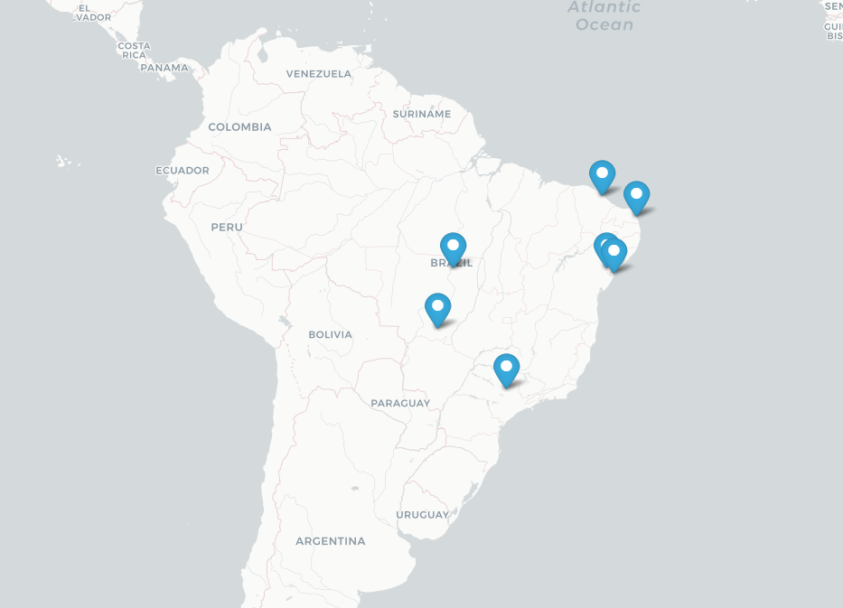

# Find-GeoLocation_Plot-on-Map
 Python Program that uses foluim and pandas module to take info from an excel file, with a list of location adresses and returns a new excel file with Lalitude and Longitude.
 Also, plots on a html map.
 
 

